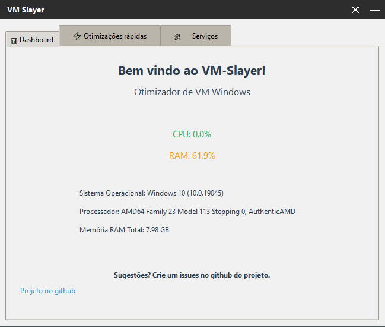

# VM Slayer 🗡️



> *"Slaying bloated VMs since 2025"*

Um utilitário simples e eficiente para otimizar máquinas virtuais Windows, automatizando a desativação de serviços desnecessários, limpeza de arquivos temporários e melhorias de desempenho.

Desenvolvido em **Python** com interface **Tkinter**, nasceu da necessidade pessoal de automatizar otimizações em minhas VMs de desenvolvimento e teste.

---

## 🎯 **Objetivo**

Facilitar a otimização de VMs para uso leve, desenvolvimento ou ambientes de teste, oferecendo uma interface intuitiva e operações seguras para maximizar performance com recursos limitados.

---

## ✅ **Funcionalidades**

### **Implementadas:**
- [x] **Desativar serviços pesados** (Superfetch, Windows Search, Windows Update, etc.)
- [x] **Limpar arquivos temporários** e cache do sistema
- [x] **Desativar hibernação** para economizar espaço em disco
- [x] **Desativar efeitos visuais** para melhor performance
- [x] **Interface gráfica amigável** com abas organizadas
- [x] **Monitoramento em tempo real** de CPU e RAM
- [x] **Controle granular** de serviços individuais

### **Planejadas para próximas versões:**
- [ ] **Remover apps bloatware** nativos do Windows
- [ ] **Backup e restauração** de configurações
- [ ] **Mais opções de otimização** avançadas
- [ ] **Relatório detalhado** das alterações realizadas

---

## 🛠️ **Tecnologias**

- **Python 3+** - Linguagem principal
- **Tkinter** - Interface gráfica nativa
- **PyInstaller** - Compilação para executável
- **psutil** - Monitoramento de sistema
- **Windows API** - Integração com sistema operacional

**Compatibilidade:** Windows 7, 8, 10 e 11

---

## ⬇️ **Instalação e Uso**

### **Método 1: Executável (Recomendado)**
1. Acesse a página de **[Releases](https://github.com/Felipeflskater/VM-Slayer/releases)**
2. Baixe o arquivo `VM-Slayer.exe` da versão mais recente
3. Execute o programa diretamente (não requer instalação)

> 📦 **Executável portátil** - Não requer Python instalado  
> ⚠️ **Execute como Administrador** para operações do sistema

### **Método 2: Código Fonte**
```bash
# Clone o repositório
git clone https://github.com/Felipeflskater/VM-Slayer.git
cd VM-Slayer

# Instale as dependências

# Execute o aplicativo
python vm_slayer.py
```

---

## 🔧 **Como Usar**

1. **Dashboard** - Monitore o uso de CPU e RAM em tempo real
2. **Otimizações Rápidas** - Aplique otimizações comuns com um clique
3. **Serviços** - Controle individual de serviços do Windows

### **Dicas de Uso:**
- Execute sempre como **Administrador** para evitar solicitações de UAC
- Teste em uma VM antes de usar em sistemas de produção
- Crie um ponto de restauração antes de aplicar otimizações

---

## 🚨 **Avisos Importantes**

- ⚠️ **Use apenas em máquinas virtuais** ou ambientes de teste
- 🔄 **Crie backup/snapshot** antes de aplicar otimizações
- 🛡️ **Execute como Administrador** para funcionamento completo
- 📝 **Algumas alterações** podem requerer reinicialização

---

## 🤝 **Contribuições**

Contribuições são bem-vindas! Veja como ajudar:

- 🐛 **Reporte bugs** através das Issues
- 💡 **Sugira melhorias** ou novas funcionalidades
- 🔧 **Envie Pull Requests** com correções ou recursos
- 📖 **Melhore a documentação**

---

## 📄 **Licença**

Este projeto está licenciado sob a [MIT License](LICENSE) - veja o arquivo de licença para mais detalhes.

---

## 💬 **Suporte**

- 🐛 **Bugs e Issues:** [GitHub Issues](https://github.com/Felipeflskater/VM-Slayer/issues)
- 💡 **Sugestões:** Abra uma Issue com a tag `enhancement`
- 📧 **Contato:** Através do perfil GitHub

---

## 🏆 **Reconhecimentos**

- Desenvolvido como projeto de aprendizado em Python
- Inspirado pela comunidade de virtualização
- Testado extensivamente em ambientes VM

---

**⭐ Se este projeto te ajudou, considere dar uma estrela no repositório!**
